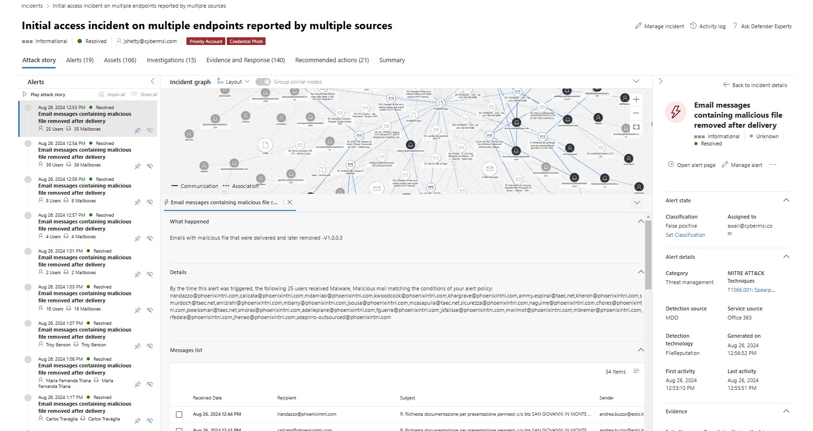
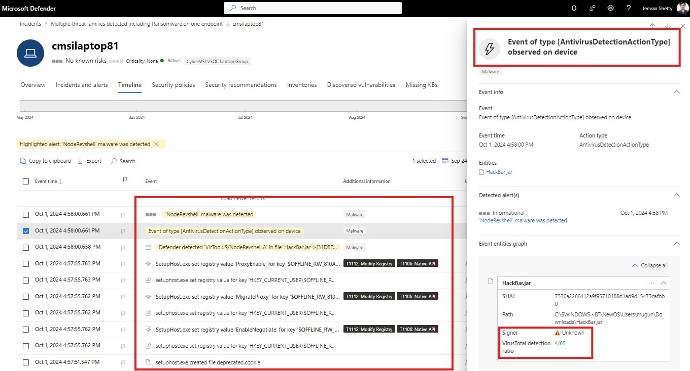
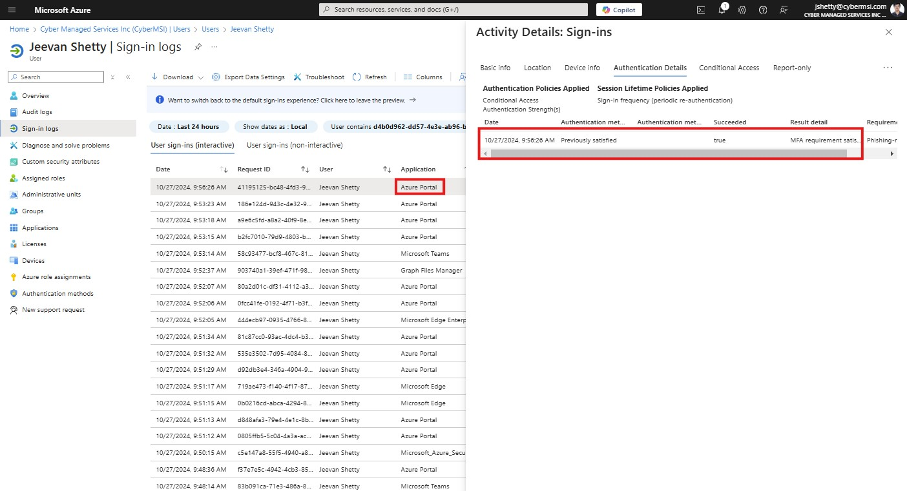
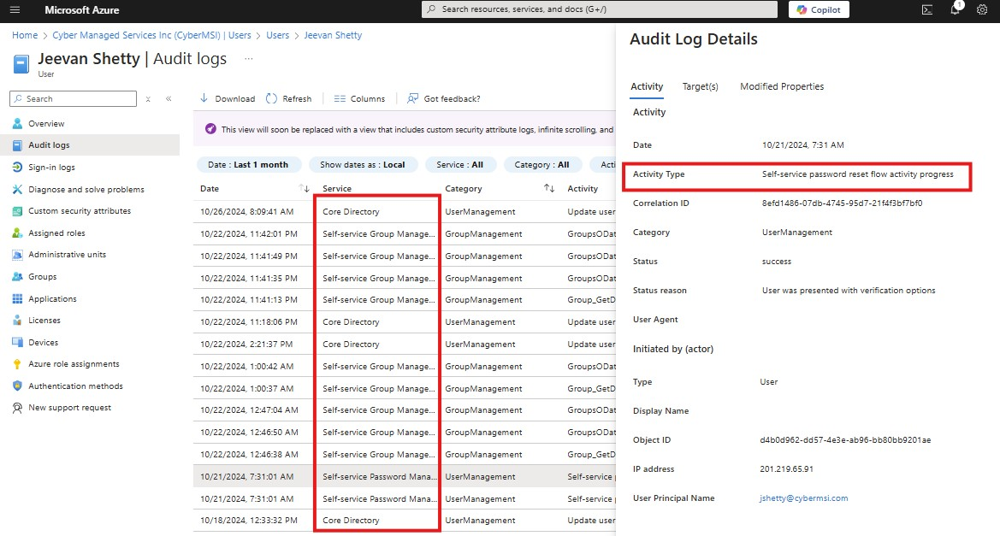
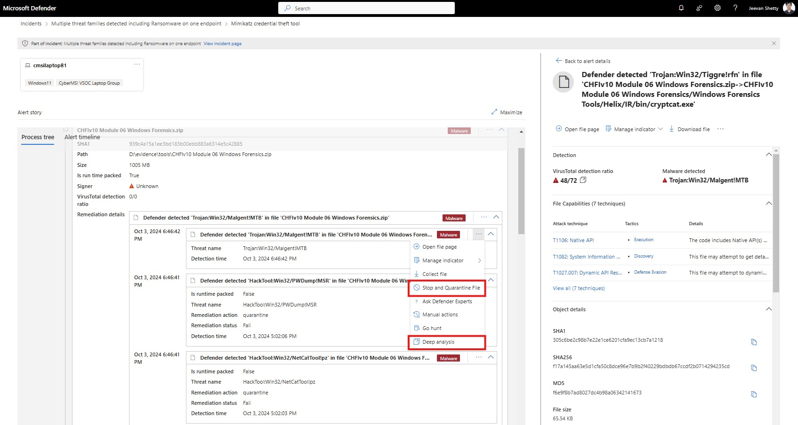

# Cyber Managed Services Inc. (CyberMSI)

**About Company :** 
Our company leads in next-generation AI-driven cybersecurity, leveraging Microsoft Defender XDR, Microsoft  Sentinel, and Microsoft Copilot for Security alongside expert insights. We provide around-the-clock managed services in Extended Detection and Response (XDR), Identity Threat Detection & Response (ITDR), Data Security, and Security Exposure Management.
Trusted by numerous mid-sized organizations in over 30 countries across four continents, we excel in safeguarding against business disruptions and data loss. Our comprehensive protection spans identities, endpoints, data, apps, infrastructure, IoT, and network, enforcing zero trust security throughout the organization.  With a 21-minute Mean Time to Respond (MTTR), we don’t just respond to threats; we fully mitigate them.
 As a Microsoft security partner, we specialize in Microsoft Copilot, Microsoft Defender XDR, Microsoft Sentinel,  Microsoft Purview, Microsoft Defender for Cloud , Microsoft Defender for Endpoints, Microsoft Defender for Office,  Microsoft Cloud App Security, Microsoft Defender for Identity, Microsoft Entra ID, and Microsoft Security Exposure Management.

 <h2 align="center"></h2>

  

### Role Description - Cybersecurity Analyst

As part of the Security Operations Center (SOC) team, analysts will manage the full Incident Management (IM) lifecycle. They will detect, analyze, and triage security incidents using monitoring tools, categorizing them by severity and assessing their potential impact. Analysts will conduct detailed investigations, leveraging Microsoft cybersecurity tools to gather evidence and perform root cause analyses to identify vulnerabilities. In addition, they will implement response strategies, including system isolation, patching, and malware removal, collaborating with IT and network teams to ensure swift resolution. Effective customer communication is key, as analysts will provide timely updates and draft concise incident reports. Analysts will also maintain accurate documentation in Jira, ensuring all incidents are tracked through their lifecycle, and participate in post-incident reviews to refine processes. They will handle escalations, coordinate with stakeholders, and contribute to post-incident evaluations, recommending long-term remediation actions to enhance the organization’s security posture. This role enables analysts to develop key skills in managing cybersecurity incidents and addressing real-world security challenges.

### Duration : Sept 2024 - Present
 <h2 align="center"></h2>

  

### Tools Used :

<h2 align="center"></h2>

## Table of contents
- [Incident Identification and Categorization](#incident-identification-and-categorization)
- [Incident Investigation and Root Cause Analysis](#incident-investigation-and-root-cause-analysis)
- [Incident Response and Mitigation](#incident-response-and-mitigation)
- [Roadmap](#roadmap)
- [Releases](#releases)
- [Contributors](#contributors)
- [Licence](#licence)

### Incident Identification and Categorization
1. Detect, analyze, and triage security incidents using monitoring tools and alerts from various systems and platforms: 
As part of the Incident Management lifecycle, your role involves actively monitoring security tools and systems to detect potential threats and anomalous behavior. Using specialized platforms such as SIEM (Security Information and Event Management) systems, you will analyze alerts triggered by abnormal activities across network traffic, endpoints, user behavior, and applications. This process includes evaluating each alert to determine its validity, relevance, and potential impact, and then triaging it—sorting incidents based on severity levels (e.g., Critical, High, Medium, low) to prioritize response efforts. This analysis is essential in filtering out false positives, identifying genuine threats, and ensuring the most serious incidents are addressed swiftly to protect the organization’s assets and data integrity.

I used "Azure Lighthouse" to gain a unified view of incidents across multiple workspaces in Azure Sentinel. By selecting all relevant workspaces within Sentinel, I accessed a consolidated overview, which enabled me to monitor and investigate security incidents occurring across different environments without switching between separate dashboards. Azure Lighthouse provided a centralized view, aggregating alerts from all connected workspaces, allowing you to quickly spot patterns, prioritize incidents, and maintain situational awareness over the security posture of multiple client or organizational environments.

This method ensured timely detection and response to incidents by providing me with quick access to key metrics and real-time data across all workspaces, which also allowed me to jump directly into any high-severity incidents, initiate triage, and begin investigations without delay.

2. Analyzing the incidents: 
I reviewed incidents in Azure Sentinel and assessed their severity by analyzing involved entities, such as IP addresses, user accounts, devices, or applications, which could indicate a potential risk. When a new incident appeared, i began by examining the specific entities flagged as malicious or suspicious. By reviewing details such as whether an entity was associated with known threats, patterns of abnormal behavior, or prior alerts, you assessed its potential to harm user devices or the broader network. 
Here's an example of me doing it.

If an entity presented a significant threat (like a compromised administrator account or a critical infrastructure device) it could lead to high impact on security, data, or operational continuity. Although Sentinel automatically assigns a severity level to incidents, sometimes investigations reveal high-value entities that may not have been fully reflected in the initial classification, By following the organizational guidelines, i ensured that all incidents (during my shift) were accurately prioritized (High, Medium, Low, Informational), directing resources toward the most critical threats while maintaining a proactive approach to emerging risks.

### Incident Investigation and Root Cause Analysis
1. Incident Investigation:  
We start by reviewing each entity to see if it has a history of suspicious activity or has been involved in previous incidents. Sentinel enables pivoting on these entities across multiple data sources, allowing analysts to evaluate their connections to other events or alerts. After reviewing entities in Sentinel, the analyst can seamlessly transition to Microsoft Defender XDR, where they’ll find detailed insights on each endpoint, network, and email activity associated with the alert. Microsoft Defender XDR consolidates endpoint, identity, and email threat intelligence, providing a unified view of the incident. Here, analysts can delve into activities directly related to compromised endpoints, lateral movement, and attacker persistence strategies.

The "Attack Story" section in Microsoft Defender XDR is pivotal for understanding the “who, what, and how” of an incident. It provides a visual representation of the entire attack sequence, detailing the alert’s origin, progression, and any related tactics or techniques. By examining the attack story, analysts can see how the incident unfolded over time, identify attacker behavior patterns, and understand which assets or data may have been affected. Each step in the attack story can be clicked on for additional details, which often include logs, commands executed, and impacted resources.
- Search File Hashes on Threat Intelligence Platforms 
  File Hash Analysis: Any suspicious files or executables detected during the investigation are converted into hashes (MD5, SHA-1, or SHA-256) and checked against reputable threat intelligence databases like VirusTotal.
- Check Email Entities for Spam or Phishing URLs 
  Email Entity Analysis: If the incident involves email-based threats, analysts focus on email entities like sender addresses, URLs, and attachments to assess potential phishing or spam content. URLs embedded in the email are inspected for redirections to known phishing sites or domains associated with malicious campaigns. Threat intelligence tools may also help identify IP addresses or domains that frequently host phishing content. 

2. Root Cause Analysis:  
Then we start by investigating device timeline within a specific timeframe to focus on, typically within a window of ±30 minutes from the first detection of malicious activity or suspicious alert. This allows the analyst to examine the immediate lead-up to and aftermath of the suspected compromise without being overwhelmed by unrelated data. Firstly start with examining key events on system and security logs to identify significant events, such as logins, logoffs, and attempts to escalate privileges, which could indicate attacker activity. Windows Event Logs, for example, can reveal details about user sessions, security policy changes, or suspicious file modifications.

- Unusual Executables: I reviewed processes and executables that were initiated on the device within the scoped timeline. They identify files that may not align with typical software behavior or scheduled tasks and determine if they match known malicious file hashes using threat intelligence platforms like VirusTotal. Suspicious executables are further analyzed to see if they attempted to establish persistence on the system (e.g., by adding registry keys or configuring scheduled tasks). If persistence mechanisms are identified, it can be a significant clue in understanding the attack's goals.
- Outbound Connections: During the specified timeframe, we look for unusual network traffic, particularly outbound connections that may indicate data exfiltration attempts or communication with command-and-control (C2) servers.

3. User Investigation:  
By accessing Sign-In and Audit Logs in Entra ID, we were able to provide detailed information on user authentication attempts, including successful and failed sign-ins, IP addresses, devices, applications accessed, and conditional access policies applied. And also any configuration or permission changes within Entra ID, including role assignments, group modifications, and application consent grants. By examining these logs, analysts can determine if unauthorized configuration changes have been made.

Sign-in logs also show if multi-factor authentication (MFA) was bypassed or failed, indicating an attacker may have attempted to access the account. Analysts verify if conditional access policies were correctly enforced, as unexpected failures here could signal policy misconfigurations or evasion attempts. IP addresses associated with a user’s logins are examined to see if they match the user’s usual locations or come from known suspicious IPs using a query. Unknown or flagged IPs might suggests a compromised account.  

Similarly, analysts align the audit log activities with the timeframe of any detected incidents. If, for instance, unusual permission changes occur around the same time as an alert, it can strongly indicate a compromise. Reviewing sign-in attempts together with audit logs helped analysts build a complete picture of how the account was accessed and potentially misused.

Role assignments or permission changes are reviewed, as attackers often attempt to elevate privileges once they’ve gained access to an account. Audit logs show exactly when and by whom these changes were made. I looked for any recently granted application consents or new applications assigned to the user. Unauthorized applications can indicate an attempt to grant persistent access to third-party applications or malicious tools. If a user has been added to sensitive groups (such as Admin or Global Admin groups) without a valid reason, this could suggest malicious intent to gain access to broader resources.

### Incident Response and Mitigation

1. Endpoint Incidents:  
After identifying and analyzing a security incident, the next crucial step was to respond in ways that prevent further damage and begin remediation. So me as an analyst would take remediation steps such as:  
- Isolating Compromised Systems: To prevent the spread of malware or unauthorized access, compromised systems are isolated from the network. This containment helps control the incident and minimize the impact on other assets.
- Applying Patches: If the incident involves a vulnerability that can be mitigated through patching, promptly applying patches reduces the risk of recurrence.
- Removing Malicious Software: This step involves eradicating any malware or unauthorized files from infected systems to restore them to a secure state where we would qurantine the file or software with help of Microsoft Defender.

"Stop & Qurantine File" means moving the file to a secure location where it can no longer execute, but the file remains available in case further analysis or restoration is needed. Microsoft Defender helps us protect the system while allowing to safely review the file if further action is needed. This is a critical step in containment to restore the system to a secure state without the risk of reinfection. 
Meanwhile we also use the "Deep Analysis" option, it helps determine how an incident originated, such as identifying the initial entry point (e.g., phishing, unpatched vulnerability). By understanding the root cause, i can implement more effective long-term fixes to prevent similar incidents in the future. Such as adding the File hash as an IOC or in the Indicator.

2. MDO/Email Incidents:  
After reviewing the mails, if the email contain malicious URLs i would delete similar phishing emails sent by the "Sender Adress", block the sender’s address, and add malicious URLs as indicators to improve the organization’s protection against similar threats in the future.

