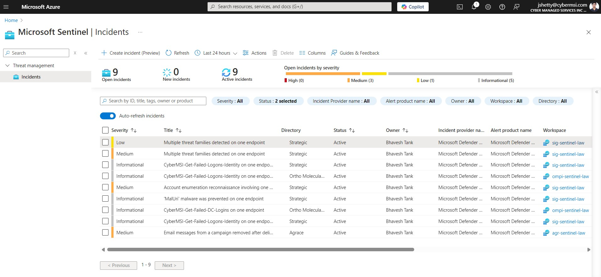
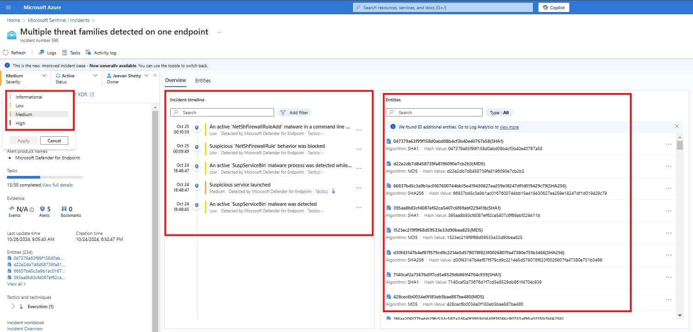

# Cyber Managed Services Inc. (CyberMSI)

**About Company :** 
Our company leads in next-generation AI-driven cybersecurity, leveraging Microsoft Defender XDR, Microsoft  Sentinel, and Microsoft Copilot for Security alongside expert insights. We provide around-the-clock managed services in Extended Detection and Response (XDR), Identity Threat Detection & Response (ITDR), Data Security, and Security Exposure Management.
Trusted by numerous mid-sized organizations in over 30 countries across four continents, we excel in safeguarding against business disruptions and data loss. Our comprehensive protection spans identities, endpoints, data, apps, infrastructure, IoT, and network, enforcing zero trust security throughout the organization.  With a 21-minute Mean Time to Respond (MTTR), we don’t just respond to threats; we fully mitigate them.
 As a Microsoft security partner, we specialize in Microsoft Copilot, Microsoft Defender XDR, Microsoft Sentinel,  Microsoft Purview, Microsoft Defender for Cloud , Microsoft Defender for Endpoints, Microsoft Defender for Office,  Microsoft Cloud App Security, Microsoft Defender for Identity, Microsoft Entra ID, and Microsoft Security Exposure Management.

 <h2 align="center"></h2>

  

### Role Description - Cybersecurity Analyst

As part of the Security Operations Center (SOC) team, analysts will manage the full Incident Management (IM) lifecycle. They will detect, analyze, and triage security incidents using monitoring tools, categorizing them by severity and assessing their potential impact. Analysts will conduct detailed investigations, leveraging Microsoft cybersecurity tools to gather evidence and perform root cause analyses to identify vulnerabilities. In addition, they will implement response strategies, including system isolation, patching, and malware removal, collaborating with IT and network teams to ensure swift resolution. Effective customer communication is key, as analysts will provide timely updates and draft concise incident reports. Analysts will also maintain accurate documentation in Jira, ensuring all incidents are tracked through their lifecycle, and participate in post-incident reviews to refine processes. They will handle escalations, coordinate with stakeholders, and contribute to post-incident evaluations, recommending long-term remediation actions to enhance the organization’s security posture. This role enables analysts to develop key skills in managing cybersecurity incidents and addressing real-world security challenges.

### Duration : Sept 2024 - Present
 <h2 align="center"></h2>

  

### Tools Used :

<h2 align="center"></h2>

## Table of contents
- [Incident Identification and Categorization](#incident-identification-and-categorization)
- [Why the MasterTemplates?](#why-the-master-templates)
- [How to use them](#how-to-use-them)
- [Roadmap](#roadmap)
- [Releases](#releases)
- [Contributors](#contributors)
- [Licence](#licence)

### Incident Identification and Categorization
1. Detect, analyze, and triage security incidents using monitoring tools and alerts from various systems and platforms: 
As part of the Incident Management lifecycle, your role involves actively monitoring security tools and systems to detect potential threats and anomalous behavior. Using specialized platforms such as SIEM (Security Information and Event Management) systems, you will analyze alerts triggered by abnormal activities across network traffic, endpoints, user behavior, and applications. This process includes evaluating each alert to determine its validity, relevance, and potential impact, and then triaging it—sorting incidents based on severity levels (e.g., Critical, High, Medium, low) to prioritize response efforts. This analysis is essential in filtering out false positives, identifying genuine threats, and ensuring the most serious incidents are addressed swiftly to protect the organization’s assets and data integrity.

I used "Azure Lighthouse" to gain a unified view of incidents across multiple workspaces in Azure Sentinel. By selecting all relevant workspaces within Sentinel, I accessed a consolidated overview, which enabled me to monitor and investigate security incidents occurring across different environments without switching between separate dashboards. Azure Lighthouse provided a centralized view, aggregating alerts from all connected workspaces, allowing you to quickly spot patterns, prioritize incidents, and maintain situational awareness over the security posture of multiple client or organizational environments.

This method ensured timely detection and response to incidents by providing me with quick access to key metrics and real-time data across all workspaces, which also allowed me to jump directly into any high-severity incidents, initiate triage, and begin investigations without delay.

2. Analyzing the incidents: 
I reviewed incidents in Azure Sentinel and assessed their severity by analyzing involved entities, such as IP addresses, user accounts, devices, or applications, which could indicate a potential risk. When a new incident appeared, i began by examining the specific entities flagged as malicious or suspicious. By reviewing details such as whether an entity was associated with known threats, patterns of abnormal behavior, or prior alerts, you assessed its potential to harm user devices or the broader network. 
Here's an example of me doing it.

If an entity presented a significant threat (like a compromised administrator account or a critical infrastructure device) it could lead to high impact on security, data, or operational continuity. Although Sentinel automatically assigns a severity level to incidents, sometimes investigations reveal high-value entities—such as critical infrastructure devices or privileged accounts—that may not have been fully reflected in the initial classification, By following the organizational guidelines, i ensured that all incidents (during my shift) were accurately prioritized (High, Medium, Low, Informational), directing resources toward the most critical threats while maintaining a proactive approach to emerging risks.
